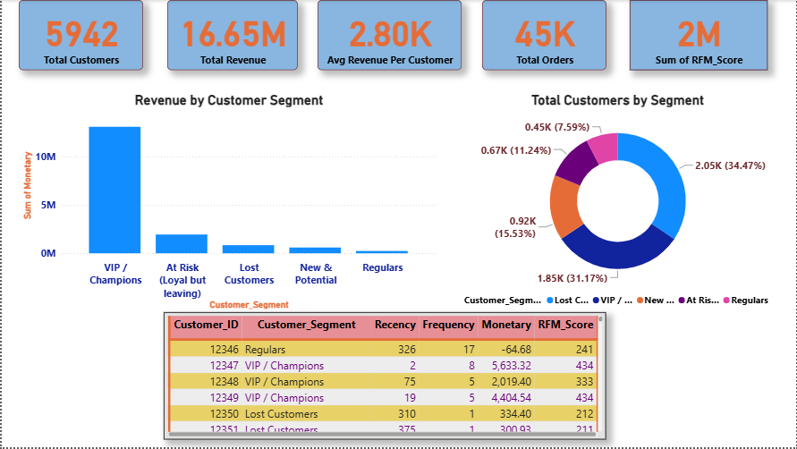

#  E-Commerce RFM Segmentation & Customer Clustering

##  Project Overview
Understanding customer behavior is essential for personalized marketing. This project involved processing over 1 million transactions to segment 5,878 unique e-commerce customers[cite: 5]. By combining traditional RFM (Recency, Frequency, Monetary) analysis with advanced K-Means clustering, the objective was to identify high-value cohorts and lapsing users for targeted marketing strategies.

##  Power BI Dashboard

##  Tech Stack & Tools
* **Language/Libraries:** Python, Pandas, Scikit-learn, PCA (Principal Component Analysis)[cite: 5]
* **Visualization & BI:** Power BI, Matplotlib, Seaborn[cite: 5]

##  Key Methodology
* **Feature Engineering:** Extracted Recency, Frequency, and Monetary values and applied log-scaling to handle extreme right-skewed revenue data[cite: 5].
* **Clustering Engine:** Applied the K-Means algorithm (k=4) achieving a silhouette score of 0.37[cite: 5].
* **Validation:** Validated cluster robustness using PCA (retaining 95% variance), seed-stability testing (ARI 0.99), and cross-comparison with rule-based RFM segments (ARI 0.50)[cite: 5].

##  Key Cohorts Discovered
* **The Champions Segment:** Identified a premium cohort comprising only 20% of the customer base, yet generating a massive **74% of total revenue (GBP 12.8M)**[cite: 5].
* **The Lapsing Loyalists:** Profiled 1,459 previously loyal customers holding GBP 2.8M in past revenue, prime for aggressive win-back campaigns[cite: 5].
* **The Dormant Segment:** Identified 34% of customers generating only 3.6% of revenue[cite: 5]. 

##  Business Impact
The data-driven segmentation directly informs marketing budget allocation. The model provides actionable recommendations to launch VIP retention programs for the 'Champions', highly targeted win-back emails for 'Lapsing Loyalists', and immediate cost-saving by ending retargeting ad-spend on the 'Dormant' cohort[cite: 5].
