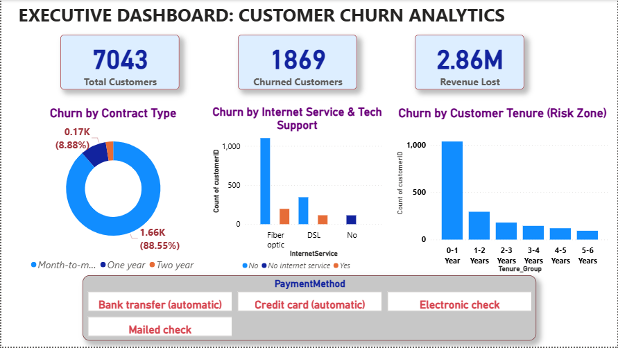

#  Telecom Customer Churn Prediction & Retention Strategy

##  Project Overview
Customer churn is a critical revenue drain in the telecom industry. This project analyzes a dataset of 7,043 customers[cite: 5], identifying a 26.5% churn rate that put $139K (30.5%) of monthly revenue at risk[cite: 5]. The goal was to build a highly accurate machine learning classifier to predict churners and optimize a targeted retention campaign.

##  Power BI Dashboard

##  Tech Stack & Tools
* **Language/Libraries:** Python, Scikit-learn, XGBoost, LightGBM, Pandas, Imbalanced-learn[cite: 5]
* **Visualization & BI:** Power BI, Matplotlib, Seaborn[cite: 5]

##  Key Insights & Methodology
* **EDA Findings:** Month-to-month contracts (42.7% churn) and Fiber optic service without tech support (49.4% churn) were identified as the primary drivers of customer attrition[cite: 5].
* **Imbalanced Data Handling:** Compared Class Weighting versus SMOTE techniques to handle the uneven churn distribution[cite: 5].
* **Model Selection:** Built and fine-tuned an XGBoost classifier using stratified 5-fold Cross-Validation and probability calibration[cite: 5].

##  Model Performance
* **ROC-AUC Score:** 0.846 (on a held-out test set)[cite: 5]
* **PR-AUC Score:** 0.664[cite: 5]

##  Business Impact & ROI
Instead of targeting all customers blindly, the decision threshold was optimized based on expected campaign profitability. This strategic approach caught 96.8% of actual churners and resulted in a **14% simulated profit lift** compared to a blanket contact strategy (assuming a 30% save rate and a $25 retention offer)[cite: 5].
